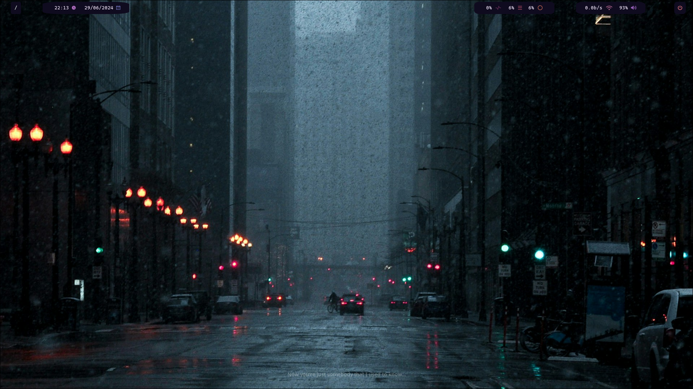

# Solstice

This was my first rice and as such is special to me. A lot of its elements were written by me while some are not. For instance, I modified css for swayNC but accidentally deleted it, now I am using the unmodified version.

## Dots that are not mine or those which I have slightly modified come from:

- [Shutdown Menu, Application Launcher, Window Switcher](https://github.com/adi1090x/rofi) from adi1090x
  > Above were modified by me.

- [swayNC config](https://github.com/kurtnettle/dotfiles/tree/a34af4152f579d705772273ae2fd45040c1b45a7/swaync) from kurtnettle
  > Mostly used as is.

I however, am including their configs here, because of the changes done by me.

## Written by me:

- Waybar Config
- Hypr Config
- Hyrplock Config

#### Read dependencies .md to find a list of dependencies. You will find dots in the .config folder.

*Any issue, questions, suggestions or improvements report on github.*
